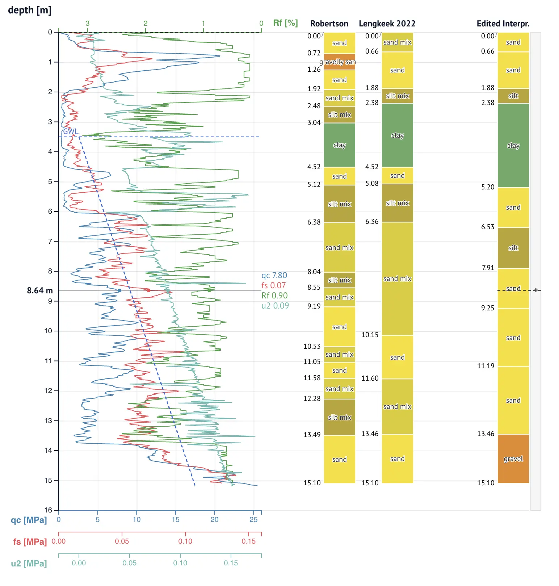

[cpt-anywidget](https://github.com/bedrock-engineer/cpt-anywidget) is a set of [anywidget](https://anywidget.dev) viewers for
cone penetration tests (CPTs) and geotechnical borehole logs, for [marimo](https://marimo.io/)
and Jupyter notebooks. The viewers accept data from any source and share one zoomable
vertical axis, showing either depth below surface or elevation in a
vertical datum.

The package contains three viewers:

- [`CPTViewer`](/docs/cpt-anywidget/reference/cpt-viewer/) shows one CPT:
  measurement channels, interpretation columns, a nearby borehole log,
  and an editable layer column.
- [`ProfileViewer`](/docs/cpt-anywidget/reference/profile-viewer/) shows
  many CPTs side by side along a profile line (a cross-section).
- [`BoreholeViewer`](/docs/cpt-anywidget/reference/borehole-viewer/) shows
  one geotechnical borehole log with soil-composition bands.



The viewers are not tied to a national standard. The Dutch standards
appear only as built-in defaults, and each has a generic counterpart:

- The BRO column names (`coneResistance`, `localFriction`, and so on)
  carry display defaults; a
  [`Channel`](/docs/cpt-anywidget/reference/cpt-viewer/#channel) binding
  does the same for any other column name.
- The `"nap"` key carries axis defaults for the Dutch vertical datum; a
  [`Vertical`](/docs/cpt-anywidget/reference/vertical/) binding does the
  same for any other datum.
- The borehole converters color layers by BRO soil names; the
  [`layers`](/docs/cpt-anywidget/reference/borehole-viewer/#layers--list)
  trait itself takes plain dicts from any source, with your own colors.

## Requirements

- Python 3.10 or newer.
- A notebook environment: marimo, Jupyter, or another anywidget host.

## Install

Install [cpt-anywidget](https://pypi.org/project/cpt-anywidget/) from
PyPI:

```sh
uv add cpt-anywidget
```

or with pip: `pip install cpt-anywidget`.

The package has no other dependencies beyond
[anywidget](https://anywidget.dev) itself. Readers such as brodata or
pygef are yours to choose and install.

## Minimal example

Put this code in a notebook cell:

```python
import polars as pl
from cpt_anywidget import CPTViewer

df = pl.DataFrame({
    "depth": [0.0, 0.02, 0.04],         # m below surface
    "coneResistance": [0.1, 0.4, 0.9],  # MPa
    "localFriction": [0.01, 0.02, 0.02],
})

CPTViewer(df, vertical="depth", channels=["coneResistance", "localFriction"])
```

The notebook shows the widget when the cell returns it, with each
channel plotted against the shared vertical axis.

## Prepare the data

The `data` argument takes
[tidy](https://data.europa.eu/apps/data-visualisation-guide/intro-to-tidy-data)
columns: a polars or pandas DataFrame, or a dict mapping column names
to any equal-length iterables (lists, tuples, numpy arrays). Each row
is one depth sample. Each column is one measurement.

The widgets **never** parse file formats or convert units; that is the
reader's job, and any reader can work:

- [brodata](https://pypi.org/project/brodata/) for Dutch [BRO](https://basisregistratieondergrond.nl/) data
- [pygef](https://pypi.org/project/pygef/) for GEF files and also geotechnical BRO XML files
- [python-ags4](https://pypi.org/project/python-ags4/) for AGS files
- plain CSV files using `polars.read_csv`

Column names are free to choose. The BRO names (`coneResistance`,
`localFriction`, `frictionRatio`, `porePressureU1`, `porePressureU2`,
and `inclination`) come with built-in labels, units, and colors. For a
column with a different name, pass a [`Channel`](/docs/cpt-anywidget/reference/cpt-viewer/#channel) binding:

```python
from cpt_anywidget import Channel

CPTViewer(df, channels=[Channel("qn", label="qn", unit="MPa", color="tomato")])
```

## Select the vertical coordinate

Set `vertical` to the column that holds the vertical coordinate. A
vertical coordinate is one of two kinds:

- a depth below surface, in m, positive down
- an elevation in a vertical datum, in m, positive up: the surface
  elevation minus the depth

Any column can be the vertical coordinate once you bind it with a
[`Vertical`](/docs/cpt-anywidget/reference/vertical/):

```python
from cpt_anywidget import Vertical

CPTViewer(df, vertical=Vertical("elevation", label="TAW [m]", up=True))
```

The names `"depth"` and `"nap"` (elevation in the Dutch datum) carry
built-in labels and formats, the same way the BRO channel names do, so
they work as plain strings.

## Use the viewer

- To zoom the vertical axis, hold the <kbd>Ctrl</kbd> key (<kbd>Cmd</kbd> on macOS) and turn
  the mouse wheel. A trackpad or touch device pinch also zooms, without pressing any keys.
- To pan a zoomed axis, drag in the plot area.
- To zoom to a range, hold the <kbd>Shift</kbd> key and drag along the axis.
- To reset the zoom, double-click in the plot area.
- To read the values at a depth, move the pointer across the plot.

The mouse wheel without a modifier key scrolls the notebook, not the
chart.

## Next steps

- [Edit layers](/docs/cpt-anywidget/edit-layers/): draw a layer
  interpretation in the widget and read it back in Python.
- [`CPTViewer` reference](/docs/cpt-anywidget/reference/cpt-viewer/):
  all traits, including annotations, overlays, interpretations, the
  borehole column, and the editable layer column.
- [`ProfileViewer` reference](/docs/cpt-anywidget/reference/profile-viewer/):
  build a cross-section from many CPTs.
- [`BoreholeViewer` reference](/docs/cpt-anywidget/reference/borehole-viewer/):
  show a borehole log from any source, with converters for BRO BHR-GT
  and GEF files.
- [Data intake reference](/docs/cpt-anywidget/reference/intake/): the
  exact data contract, and the `tidy` and `split` helpers.
