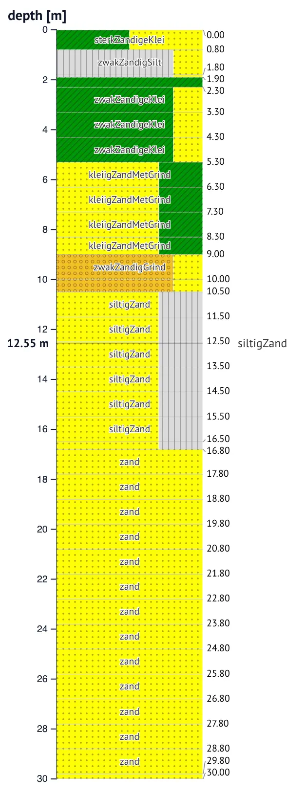

`BoreholeViewer` shows one geotechnical borehole log: soil-composition
bands per layer on a shared, zoomable vertical axis, with hover readouts
and reference-line annotations. The zoom and brush interactions match
`CPTViewer`, so the two can sit side by side on the same axis.



```python
from cpt_anywidget import BoreholeViewer

BoreholeViewer(layers=[
    {"top": 0.0, "bottom": 1.5, "label": "klei",
     "bands": [{"x1": 0, "x2": 1, "color": "#78a86c"}]},
])
```

The `layers` trait is plain dicts: build it from any source (AGS, CSV,
your own interpretation) with whatever colors fit your legend. The two
converters are shortcuts for data that already speaks the Dutch BRO
vocabulary, because the soil colors they apply are keyed by BRO
geotechnical soil names: [`layers_from_bhrgt`](#layers_from_bhrgt) for
brodata's parsed BHR-GT objects, and
[`layers_from_bore`](#layers_from_bore) for pygef's borehole logs (GEF
or BRO XML, which pygef normalizes to those soil names).

## Traits

### `layers` — list

The borehole layers, shallowest first:

```python
[{"top": 0.0, "bottom": 1.5, "label": "klei",
  "bands": [{"x1": 0.0, "x2": 0.7, "color": "#78a86c"},
            {"x1": 0.7, "x2": 1.0, "color": "#f4e04d", "hatch": "."}]}]
```

`top` and `bottom` are values in the current vertical coordinate. Each
layer holds proportional soil-composition `bands`: `x1` and `x2` are
fractions in `[0, 1]`. `hatch` is an optional matplotlib-style pattern
character (`-`, `/`, `\`, `.`, `o`, `|`) rendered as an SVG pattern.

The widget labels each layer boundary with its depth, in a strip right
of the bands. When layers get thin, the labels dodge apart and leader
lines point back to their boundaries, the same behavior as the
interpretation columns in `CPTViewer`.

A layer can also carry an optional `description` holding free text,
such as the driller's field description. While you hover the layer, the
soil name and the description show word-wrapped in the readout area
right of the label strip.

### `verticalKey` — str or dict

The vertical coordinate the layers are expressed in. Default:
`"depth"`. Only used for the axis label and the readout format; the
layer order drives the axis direction. Same contract as
[`CPTViewer.verticalKey`](/docs/cpt-anywidget/reference/cpt-viewer/#verticalkey--str-or-dict).

### `axisLimits` — dict

`{verticalKey: [min, max]}` override for the vertical axis. The
data-driven fallback spans the first layer's top to the last layer's
bottom.

### `annotations` — list

Horizontal reference lines, for example a groundwater level. Same shape
as
[`CPTViewer.annotations`](/docs/cpt-anywidget/reference/cpt-viewer/#annotations--list).

### `width`, `height` — int

The plot size in pixels. `0` (the default) falls back to 220×800. The
boundary-label strip and the hover readouts widen the widget beyond
`width`.

## layers_from_bhrgt

```python
layers_from_bhrgt(bhrgt, vertical_key="depth")
```

Converts a `brodata.bhr.GeotechnicalBoreholeResearch` object into the
[`layers`](#layers--list) trait. The helper only reads the parsed
object; parsing the file with
[brodata](https://pypi.org/project/brodata/) is up to you.

| Parameter | Type | Description |
| --- | --- | --- |
| `bhrgt` | GeotechnicalBoreholeResearch | A parsed BRO BHR-GT object from brodata. |
| `vertical_key` | str, `Vertical`, or dict | The target vertical coordinate. `"depth"` keeps depth below surface. A positive-up coordinate such as `"nap"` converts through the borehole's surface offset. |

Each descriptive-log layer becomes `{"top", "bottom", "label", "bands"}`.
The bands come from a built-in copy of the BRO lithology table. A soil
name missing from that table gets a single gray band.

```python
from brodata.bhr import GeotechnicalBoreholeResearch
from cpt_anywidget import BoreholeViewer, layers_from_bhrgt

bhrgt = GeotechnicalBoreholeResearch("bhrgt.xml")
BoreholeViewer(layers=layers_from_bhrgt(bhrgt, "nap"), verticalKey="nap")
```

## layers_from_bore

```python
layers_from_bore(bore, vertical_key="depth")
```

Converts a `pygef.bore.BoreData` (pygef's parse of a GEF or BRO XML
borehole) into the [`layers`](#layers--list) trait. pygef normalizes
both formats to BRO geotechnical soil names, so the layers get the same
lithology colors and hatches as `layers_from_bhrgt`. A layer's `remarks`
(the field description) becomes its `description`, shown on hover.
Needs only [pygef](https://cemsbv.github.io/pygef/), for the parsing
upstream.

| Parameter | Type | Description |
| --- | --- | --- |
| `bore` | BoreData | A parsed borehole from `pygef.read_bore`. |
| `vertical_key` | str, `Vertical`, or dict | The target vertical coordinate, as in `layers_from_bhrgt`. Positive-up coordinates use the bore's delivered vertical position offset. |

```python
import pygef
from cpt_anywidget import BoreholeViewer, layers_from_bore

bore = pygef.read_bore("borehole.gef")
BoreholeViewer(layers=layers_from_bore(bore), verticalKey="depth")
```
