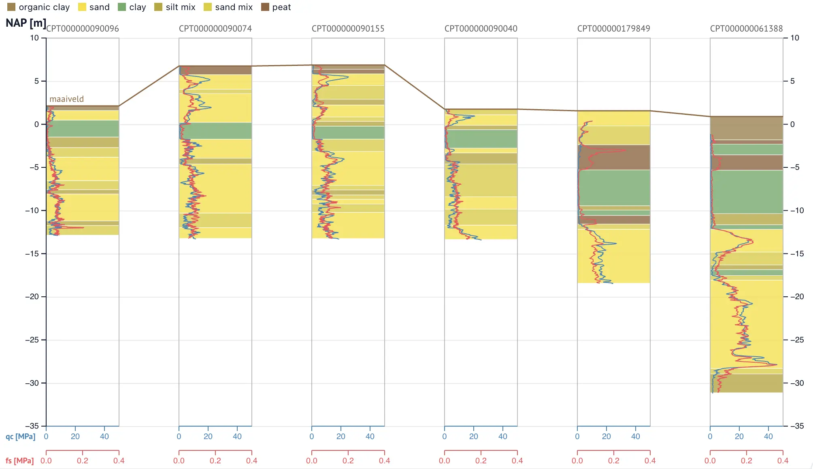

`ProfileViewer` shows a length profile (a cross-section): many CPTs side
by side as strips on one shared, zoomable vertical axis. Each strip is
anchored by its chainage along the profile line. A toolbar toggle
switches between true-scale spacing and equal spacing. A click selects a
strip and syncs its name back to Python.



```python
from cpt_anywidget import ProfileViewer, chainage

positions = chainage({
    "CPT-01": (120601.0, 487429.0),   # map coordinates, in profile order
    "CPT-02": (120655.0, 487410.0),
})

ProfileViewer(long_df, positions=positions, channels=["coneResistance"])
```

## Constructor

```python
ProfileViewer(data=None, *, positions=None, name="name", vertical=None,
              channels=None, layers=None, limits=None, **kwargs)
```

The constructor is a facade over the [traits](#traits). You can also
pass any trait directly as a keyword argument. Data passed raw via
`cpts=` skips the intake step.

| Parameter | Type | Description |
| --- | --- | --- |
| `data` | DataFrame or dict | Tidy **long**-format columns: every CPT's samples stacked, with a name column that tells them apart. Rows are grouped per CPT via [`split`](/docs/cpt-anywidget/reference/intake/#split); each group then goes through [`tidy`](/docs/cpt-anywidget/reference/intake/#tidy). |
| `positions` | dict | `{name: chainage}` in m along the profile line. Every name in `data` must be present; a missing name raises. When omitted, strips fall in input order, one unit apart, which only makes sense with equal spacing. See [`chainage`](#chainage). |
| `name` | str | The column that holds the CPT names. Default: `"name"`. |
| `vertical` | str, `Vertical`, or dict | The vertical-coordinate column. Default: `"nap"`, because a profile compares elevations across CPTs. |
| `channels` | list | The channels every strip plots. Mix column-name strings, [`Channel`](/docs/cpt-anywidget/reference/cpt-viewer/#channel) bindings, and raw dicts. When omitted, every strip plots cone resistance only. |
| `layers` | dict | `{name: [{"top", "bottom", "color"?, "label"?}, ...]}` interpreted layers per CPT, drawn as a backdrop behind the strip's curves. A name absent from `data` raises. |
| `limits` | dict | `{column: (min, max)}` axis overrides. The plotted channel's pair sets the one scale shared by all strips. |
| `**kwargs` | | Trait names pass through unchanged. |

## chainage

```python
chainage(coords)
```

Computes the cumulative along-profile distance per CPT from map
coordinates. Feed the result to `ProfileViewer` as `positions`.

| Parameter | Type | Description |
| --- | --- | --- |
| `coords` | dict | `{name: (x, y)}` in a projected CRS (for example RD New), **in profile order**. |

Each CPT's chainage is the summed straight-line distance over its
predecessors. The first entry is at 0.

## Traits

### `cpts` — list

The strips:

```python
[{"name": "CPT-01", "distance": 0.0,
  "data": {"nap": [...], "coneResistance": [...]},
  "layers": [{"top": 1.2, "bottom": -0.8, "color": "#f4e04d"}]}]
```

`distance` is the chainage in m. `data` follows the
[`cptData` contract](/docs/cpt-anywidget/reference/cpt-viewer/#cptdata--dict).
`layers` is optional and renders as a semi-transparent backdrop behind
the strip's curves.

### `verticalKey` — str or dict

The data column that is the vertical coordinate. Default: `"nap"`. Same
contract as
[`CPTViewer.verticalKey`](/docs/cpt-anywidget/reference/cpt-viewer/#verticalkey--str-or-dict).

### `axisLimits` — dict

`[min, max]` overrides. The plotted channel's key sets the one scale
shared by all strips. Key the vertical override by the `verticalKey`.

### `channels` — list

The channels every strip plots. Same entry shape and axis sides as
[`CPTViewer.channels`](/docs/cpt-anywidget/reference/cpt-viewer/#channels--list):
bottom axes stack below the strips with zero at the left, top axes
(Rf, inclination) stack above them with zero at the right, so a curve
reads the same here as in a `CPTViewer`. An empty list plots cone
resistance only.

### `overlays` — list

Profile-space lines over the strips. Two forms:

```python
# a polyline in (chainage, vertical) space
[{"points": [[0.0, 1.2], [54.0, 0.8]], "label": "GWL", "color": "steelblue"}]

# per-strip levels, for example each CPT's surface elevation
[{"levels": {"CPT-01": 1.2, "CPT-02": 0.9}, "label": "surface"}]
```

`points` pairs are `[distance, v]`: distance in m chainage, v in the
vertical coordinate. Under equal spacing, the x positions interpolate
between the strip anchors.

`levels` draws each value flat across that strip's width, with sloping
connectors between consecutive strips. An absent name bridges to the
next strip with a value. An explicit `None` breaks the line.

Both forms accept `color`, `dash`, and `width`.

### `annotations` — list

Horizontal reference lines spanning the whole profile. Same shape as
[`CPTViewer.annotations`](/docs/cpt-anywidget/reference/cpt-viewer/#annotations--list).

### `equalSpacing` — bool, bidirectional

`False` (the default) anchors strips at true chainage. `True` spaces
them evenly. The toolbar toggle in the widget writes this trait back.

### `selected` — str, bidirectional

The clicked strip's name, `""` when nothing is selected. Clicking the
selected strip again deselects it. Observe this trait to react in
Python, for example to open a full `CPTViewer` beside the profile:

```python
profile.observe(lambda change: open_cpt(change["new"]), names="selected")
```

### `stripWidth` — int

Pixels per strip. `0` (the default) falls back to 90.

### `width`, `height` — int

The plot size in pixels. `0` falls back to 700×500. Width is a minimum:
the svg grows past it, and the widget scrolls sideways, whenever
true-scale chainage or the strip count needs the room.

When the profile scrolls, an overview bar appears above it: one mark
per strip, and a rectangle showing the visible part. Drag the
rectangle, or click the track, to navigate. The bar hides again when
the whole profile fits.
